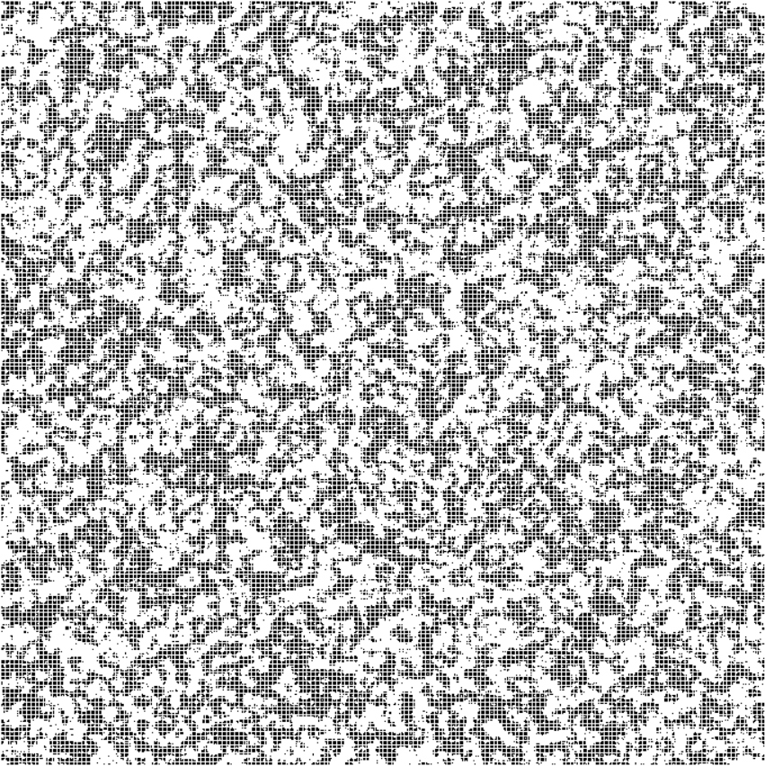

# Ising-Lenz model simulator

The program predicts the expected behaviour of a **ferromagnet**, represented as a **lattice of spins** (whose values are binary), in conditions of temperature and external magnetic field given as input. It does so by applying the **Metropolis algorithm**, which determines if a random chosen spin is flipped according to the variation of the system's **Hamiltonian**.

The graphical representation of the model, implemented with **SFML**, consists of a **vertex array**, in which black and white colored ones correspond, respectively, to positive and negative spins.

The compilation is carried out using **CMake**.

  <i> Output example with null external field and subcritical temperature </i>

